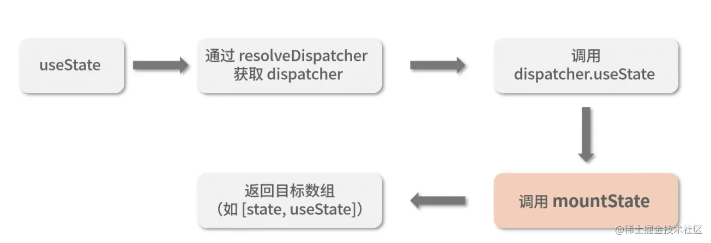
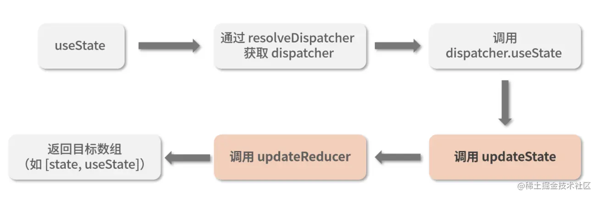

# Class 组件的生命周期

## 挂载阶段

1. construct 构造函数
2. getDerivedStateFromProps 某个 props 需要更新相关的 state 是使用
3. render 渲染组件
4. componentDidMount 组件挂载完成后, 可以获取 dom

## 更新阶段

1. getDerivedStateFromProps
2. shouldComponentUpdate `return true || false`来决定是否更新组件
3. return
4. getSnapshotBeforeUpdate 需要一个返回值,是 componentDidUpdate 第三个入参
5. componentDidUpdate 能够获取到更新后的 dom

## 卸载阶段

1. componentWillUnmount 组件卸载前执行,清零定时器

# useLayoutEffect 和 useEffect 有什么区别?

## API

- useLayoutEffect
  useLayoutEffect 是在 DOM 更新完成后浏览器绘制之前同步执行的钩子函数. 他会在 DOM 更新后立即执行,阻塞浏览器绘制过程.这使得他更适合于立即获取最新的 DOM 布局信息的操作,如测量元素尺寸或位置等。使用 useLayoutEffect 可以在更新后同步触发副作用，从而保证 DOM 的一致性。

- useEffect
  useEffect 是在组件渲染完毕后异步执行的钩子函数.他会在浏览器绘制完成后延迟执行,不会阻塞浏览器绘制过程.这使得他更适用于处理副作用的操作,如 http 请求,设置订阅事件,设置定时器.使用 useEffect 可以将副作用操作放到组件渲染完成后执行，以避免阻塞浏览器绘制。

## 总结

- useLayoutEffect 是同步执行的钩子函数,在 DOM 更新完成后执行,会阻塞浏览器绘制,更适用于处理 DOM 布局信息的副作用操作.
- useEffect 是异步执行的钩子函数,在浏览器绘制后延迟执行,不会阻塞浏览器绘制,更适用于处理 HTTP 请求,订阅事件,定时器等副作用操作.

通常情况下，应优先使用 useEffect，因为它不会阻塞浏览器的渲染，并且能够满足大多数的副作用操作需求。只有在需要获取最新的 DOM 布局信息并立即触发副作用时，才需要使用 useLayoutEffect。

# 如何避免不必要的渲染?

1. 通过 PureComponent 组件
2. 通过 shouldComponentUpdate
3. 避免在 class 组件的 render 函数中穿件新的对象: 由于对象的引用发生变化，React 将会认为组件的 props 或 state 发生了变化，从而触发重新渲染。因此，应尽量避免在 render 方法中创建新的对象，尤其是在大型数据结构中。
4. 使用 key 属性唯一标识列表项：在渲染列表时，为每个列表项指定唯一的 key 属性。这样，当列表项重新排序、添加或删除时，React 可以更准确地确定哪些列表项需要重新渲染，而不是重新渲染整个列表。
5. 使用 useCallback 和 useMemo 避免不必要的函数和计算：使用 useCallback 缓存函数引用，以确保只有在其依赖项发生变化时才重新创建函数。使用 useMemo 缓存计算结果，以确保只有在其依赖项发生变化时才重新计算结果。这些钩子函数可以帮助避免不必要的函数创建和计算过程，从而提高性能。
6. 使用 React.lazy 和 Suspense 实现按需加载组件：使用 React.lazy 函数和 Suspense 组件可以实现按需加载组件，只在需要时才加载组件代码。这可以减少初始渲染时的资源负载。

# 是如何渲染的?

1. 解析 JSX: 在编译阶段 React 会借助 Babel 等工具把 JSX 转换为 JavaScript 对象.
2. 创建虚拟 DOM: React 使用解析后的 JSX 对象来创建虚拟 DOM(Virtual DOM). 虚拟 DOM 是一个轻量级的、以 JavaScript 对象表示的 DOM 树的副本.
3. Diff 算法比较变化生成 Patch: 在每次组件更新后,React 使用 Diff 算法对比新旧两株虚拟 DOM 树的差异生成 Patch.
4. 根据 Patch 生成 DOM 操作 :根据 Diff 算法的比较结果，React 会生成一系列的 DOM 更新操作，包括添加、移除和修改节点等。这些操作被存储在更新队列中。
5. 批量进行 DOM 更新：React 会将更新队列中的 DOM 更新操作批量进行，以减少浏览器的重绘和回流操作。React 会通过批量更新来优化性能。
6. 应用 DOM 更新：最后，React 将批量的 DOM 更新操作应用到实际的浏览器 DOM 中，从而更新用户界面。这个过程中，React 会尽量最小化对真实 DOM 的操作，以提高性能。

# 高阶组件理解多少？

## 什么是高阶组件

是一种基于 React 特性形成的复用组件逻辑的设计模式,他本质是个函数,接受一个组件作为参数,并返回一个新的组件.

## React 高阶组件需要满足以下条件：

1. 接受一个组件作为参数：高阶组件函数应该接受一个组件作为参数，并返回一个新的增强过的组件。

2. 返回一个新的组件：高阶组件函数应该在内部创建一个新的组件，并将其返回作为结果。这个新组件可以是一个类组件或函数组件。

3. 传递 props：高阶组件应该将传递给它的 props 传递给原始组件，可以通过使用展开运算符或手动传递 props 进行传递。

4. 可以修改 props：高阶组件可以对传递给原始组件的 props 进行处理、转换或增加额外的 props。

5. 可以访问组件生命周期方法和状态：高阶组件可以在新组件中访问组件的生命周期方法和状态，并根据需要执行逻辑。

## 使用场景

1. 代码复用,当多个组件之间有相同的逻辑和功能时，可以将这些逻辑和功能抽象成一个高阶组件，并在多个组件中使用该高阶组件进行代码复用。

```js
const withLogging = (WrappedComponent) => {
  return (props) => {
    useEffect(() => {
      console.log("Component is mounted");
    }, []);

    return <WrappedComponent {...props} />;
  };
};

const MyComponent = withLogging(MyOriginalComponent);
```

2. 条件渲染：高阶组件可以根据一些条件来决定是否渲染原始组件或其他组件。这对于实现权限控制、用户认证等场景非常有用。

```js
const withAuthorization = (WrappedComponent) => {
  return (props) => {
    if (props.isAuthenticated) {
      return <WrappedComponent {...props} />;
    } else {
      return <div>Unauthorized</div>;
    }
  };
};

const MyComponent = withAuthorization(MyOriginalComponent);
```

3. Props 改变：高阶组件可以监听原始组件的 props 的变化，并在变化时执行一些逻辑。这对于实现数据的深拷贝、数据的格式化等场景非常有用。

```js
const withDeepCopy = (WrappedComponent) => {
  return (props) => {
    const prevPropsRef = useRef(props);

    useEffect(() => {
      if (prevPropsRef.current.data !== props.data) {
        const copiedData = JSON.parse(JSON.stringify(props.data));
        // Do something with copiedData...
      }

      prevPropsRef.current = props;
    }, [props.data]);

    return <WrappedComponent {...props} />;
  };
};

const MyComponent = withDeepCopy(MyOriginalComponent);
```

4. 功能增强：高阶组件可以对原始组件的功能进行增强，例如增加表单校验、日志记录、性能优化等。

```js
const withFormValidation = (WrappedComponent) => {
  return (props) => {
    const [isValid, setValid] = useState(false);

    const validateForm = () => {
      // Perform form validation logic...
      setValid(true);
    };

    return (
      <div>
        <WrappedComponent {...props} />
        {isValid ? <div>Form is valid</div> : <div>Form is invalid</div>}
      </div>
    );
  };
};

const MyComponent = withFormValidation(MyOriginalComponent);
```

5. 渲染劫持：高阶组件可以在原始组件渲染之前或之后执行一些逻辑，例如在渲染之前进行数据加载，或在渲染之后进行动画效果的添加等。

```js
const withDataFetching = (WrappedComponent) => {
  return (props) => {
    const [data, setData] = useState(null);

    useEffect(() => {
      // Fetch data...
      axios
        .get("/api/data")
        .then((response) => {
          setData(response.data);
        })
        .catch((error) => {
          console.error("Error fetching data:", error);
        });
    }, []);

    if (data === null) {
      return <div>Loading...</div>;
    } else {
      return <WrappedComponent data={data} {...props} />;
    }
  };
};

const MyComponent = withDataFetching(MyOriginalComponent);
```

总的来说，React 高阶组件提供了一种灵活的方式来对组件进行组合和功能增强，可以在不修改原始组件的情况下对其进行扩展和定制。

# Class Component, Pure Component, Function Component 三个组件的区别

- Class Component
  Class 组件使用 ES6 的类语法定义的组件,他是继承自 React.Component 的一个子类.Class 组件有自己的状态和生命周期方法,可以通过`this.state`来管理状态,`this.setState`来更新状态.
- Pure Component
  纯组件也是使用 ES6 的类语法定义的租金啊,但是他是继承自 React.PureComponent 的一个子类,也拥有自己的状态和生命周期,但是纯组件可以自动执行`shouldComponentUpdate`把 state 和 props 与之前的值作浅比较,一致时会跳过重新渲染.

- Function Component
  函数组件是使用函数来定义的组件,在 React16.8 版本引入 hooks 后可以通过`React.useState`来管理更新状态,`React.useEffect`来处理副作用.

# 如何给 children 添加额外的属性?

使用 React.cloneElement 来添加而外的属性

```js
React.cloneElement(element, { ...oldProps, extra: "xxx" });
```

# createElement 和 cloneElement 有什么区别

React 中的 createElement 和 cloneElement 都可以用来创建元素，但它们用法有所不同。

createElement 用于在 React 中动态地创建一个新的元素，并返回一个 React 元素对象。它的用法如下：

```js
React.createElement(type, [props], [...children]);
```

其中，type 是指要创建的元素的类型，可以是一个 HTML 标签名（如 div、span 等），也可以是一个 React 组件类（如自定义的组件），props 是一个包含该元素需要设置的属性信息的对象，children 是一个包含其子元素的数组。createElement 会以这些参数为基础创建并返回一个 React 元素对象，React 将使用它来构建真正的 DOM 元素。

cloneElement 用于复制一个已有的元素，并返回一个新的 React 元素，同时可以修改它的一些属性。它的用法如下：

```js
React.cloneElement(element, [props], [...children]);
```

其中，element 是指要复制的 React 元素对象，props 是一个包含需要覆盖或添加的属性的对象，children 是一个包含其修改后的子元素的数组。cloneElement 会以这些参数为基础复制该元素，并返回一个新的 React 元素对象。

在实际使用中，createElement 通常用于创建新的元素（如动态生成列表），而 cloneElement 更适用于用于修改已有的元素，例如在一个组件内部使用 cloneElement 来修改传递进来的子组件的属性。

## cloneElement 有哪些应用场景

1. 修改 props
   cloneElement 可以用于复制一个已有的元素并覆盖或添加一些新的属性。例如，可以复制一个带有默认属性的组件并传递新的属性，达到修改属性的目的。

   ```js
   // 假设有这样一个组件
   function MyComponent(props) {
     // ...
   }

   // 在另一个组件中使用 cloneElement 修改 MyComponent 的 props
   function AnotherComponent() {
     return React.cloneElement(<MyComponent />, { color: "red" });
   }
   ```

2. 渲染列表
   在渲染列表时，可以使用 Array.map() 生成一系列的元素数组，也可以使用 React.Children.map() 遍历子元素并返回一系列的元素数组，同时使用 cloneElement 复制元素并传入新的 key 和 props。

   ```js
   // 使用 Children.map() 遍历子元素并复制元素
   function MyList({ children, color }) {
     return (
       <ul>
         {React.Children.map(children, (child, index) =>
           React.cloneElement(child, { key: index, color })
         )}
       </ul>
     );
   }

   // 在组件中使用 MyList 渲染列表元素
   function MyPage() {
     return (
       <MyList color="red">
         <li>Item 1</li>
         <li>Item 2</li>
         <li>Item 3</li>
       </MyList>
     );
   }
   ```

3. 修改子元素
   使用 cloneElement 也可以在一个组件内部修改传递进来的子组件的属性，例如修改按钮的样式。

   ```js
   function ButtonGroup({ children, style }) {
     return (
       <div style={style}>
         {React.Children.map(children, (child) =>
           React.cloneElement(child, { style: { color: "red" } })
         )}
       </div>
     );
   }

   function MyPage() {
     return (
       <ButtonGroup style={{ display: "flex" }}>
         <button>Save</button>
         <button>Cancel</button>
       </ButtonGroup>
     );
   }
   ```

# hooks 和 memorizedState 是什么关系?

- hooks 和 `memorizedState` 之间的关系
  在 React 中 hooks 是一种特殊的函数,用于在函数组件中添加和管理状态以及其它 `React` 特性(比如声明周期). 而`memorizedState`是 React 内部用于储存和管理 hooks 状态的数据结构.

当你在函数组件中使用 Hooks（如 useState、useEffect 等）时，React 会在组件首次渲染时创建一个 memorizedState 链表。这个链表中的节点包含了组件的各个状态值。

每个节点都包含了两个重要的属性：memoizedState 和 next。memoizedState 是该节点对应的状态值，而 next 是指向下一个节点的指针。这样就形成了一个链表，其中的节点对应于组件中的不同状态。

当组件重新渲染时，React 会通过 memorizedState 链表找到与组件对应的节点，并将其中的状态值返回给组件。当调用状态更新的函数时，React 会在 memorizedState 链表中找到与组件对应的节点，并将其中的状态值更新为新的值。

因此，Hooks 和 memorizedState 是紧密相关的，Hooks 通过 memorizedState 实现了状态的管理和更新。这种关系使得在函数组件中使用 Hooks 能够实现声明式的、可持久的状态管理，并且方便 React 进行性能优化。

- hooks 和 memorizedState 是怎么关联起来的？
  在 React 中，Hooks 和 memorizedState 通过一种特殊的数据结构关联起来，这个数据结构被称为 Fiber 节点。

每个函数组件都对应一个 Fiber 节点，Fiber 节点中包含了组件的各种信息，包括组件的状态（memorizedState）、props、子节点等。

当一个函数组件被调用时，React 会创建一个新的 Fiber 节点，并将其与函数组件关联起来。在这个 Fiber 节点中，React 会通过 memoizedState 属性存储组件的状态值。

当函数组件重新渲染时，React 会更新对应的 Fiber 节点。在更新过程中，React 会根据函数组件中的 Hooks 调用顺序，遍历 memorizedState 链表中的节点。

React 会根据 Hooks 调用的顺序，将当前的 memorizedState 链表中的节点与新的 Hooks 调用结果进行比较，并更新 memoizedState 中的值。

这个过程中，React 会使用一些算法来比较和更新 memorizedState 链表中的节点，以确保状态的正确性和一致性。例如，React 可能会使用链表的插入、删除、移动等操作来更新 memorizedState 链表。

通过这样的机制，Hooks 和 memorizedState 实现了状态的管理和更新。Hooks 提供了一种声明式的方式，让我们能够在函数组件中使用和更新状态，而 memorizedState 则是 React 内部用于存储和管理这些状态的数据结构。

- useState 和 memorizedState 状态举例
  当组件首次渲染时（mount 阶段），React 会创建一个新的 Fiber 节点，并在其中创建一个 memorizedState 来存储 useState hook 的初始值。这个 memorizedState 会被添加到 Fiber 节点的 memoizedState 属性中。

在更新阶段（update 阶段），当组件重新渲染时，React 会通过比较前后两次渲染中的 memorizedState 来判断状态是否发生了变化。

React 会根据 useState hook 的调用顺序来确定 memorizedState 的位置。例如，在一个组件中多次调用了 useState hook，React 会按照调用的顺序在 memoizedState 属性中创建对应的 memorizedState。

举一个例子，假设我们有一个表单组件，其中使用了两个 useState hook 来存储用户名和密码的值：

```js
import React, { useState } from "react";

function LoginForm() {
  const [username, setUsername] = useState("");
  const [password, setPassword] = useState("");

  return (
    <form>
      <input
        type="text"
        value={username}
        onChange={(e) => setUsername(e.target.value)}
      />
      <input
        type="password"
        value={password}
        onChange={(e) => setPassword(e.target.value)}
      />
      <button type="submit">Submit</button>
    </form>
  );
}
```

````

在这个例子中，我们在组件函数中分别调用了两次 useState hook，创建了 username 和 password 这两个状态。

在首次渲染时（mount 阶段），React 会为每一个 useState hook 创建一个 memorizedState 对象，并将它们存储在组件的 Fiber 节点的 memoizedState 属性中。

当我们输入用户名或密码并触发 onChange 事件时，React 会进入更新阶段（update 阶段）。在这个阶段，React 会比较前后两次渲染中的 memorizedState，并根据变化的状态来更新 UI。

React 会比较 username 和 password 的旧值和新值，如果有变化，会更新对应的 Fiber 节点中的 memoizedState，然后重新渲染组件，并将最新的 username 和 password 值传递给相应的 input 元素。

通过比较 memorizedState，React 能够检测到状态的变化，并只更新发生变化的部分，以提高性能和优化渲染过程。

# Hooks 的使用守则是什么

## 守则

Hooks 必须在 React 函数组件的顶层使用,**不要在循环、条件语句、嵌套函数或 try/catch/finally 代码块中调用 Hook**.

## 后果

违反规则会导致报错,React 实现函数组件的状态添加和管理是通过`memorizedState`数据格式来实现的,它是一种链表数据结构,在函数组件初始化阶段会按照`Hooks`的执行顺序添加到`memorizedState`中,在更新状态是通过循环调用对比新旧的`memorizedState`中的状态,如果在**循环,判断,嵌套等代码块中执行**会导致错位,执行错误的 hook 更新.

## 如果要在循环等语句块中使用 hook 能力

可以把里面的内容抽成一个函数组件

# ref 有哪些使用场景，请举例

React 的 ref 用于获取组件或 DOM 元素的引用。它有以下几个常见的使用场景：

- 访问子组件的方法或属性：通过 ref 可以获取子组件的实例，并调用其方法或访问其属性。

```js
import React, { useRef } from "react";

function ChildComponent() {
  const childRef = useRef(null);

  const handleClick = () => {
    childRef.current.doSomething();
  };

  return (
    <div>
      <button onClick={handleClick}>Click</button>
      <Child ref={childRef} />
    </div>
  );
}

const Child = React.forwardRef((props, ref) => {
  const doSomething = () => {
    console.log("Doing something...");
  };

  // 将ref引用绑定到组件的实例
  React.useImperativeHandle(ref, () => ({
    doSomething,
  }));

  return <div>Child Component</div>;
});
````

- 获取 DOM 元素：通过 ref 可以获取组件渲染后的 DOM 元素，并进行操作。

- 动态引用：通过 ref 可以在函数组件中动态地引用不同的组件或 DOM 元素。

```js
import React, { useRef } from "react";

function MyComponent() {
  const ref = useRef(null);
  const condition = true;

  const handleClick = () => {
    ref.current.doSomething();
  };

  return (
    <div>
      {condition ? <ChildComponent ref={ref} /> : <OtherComponent ref={ref} />}
      <button onClick={handleClick}>Click</button>
    </div>
  );
}
```

# 合成事件和原生事件触发的先后顺序如何？

在新版本的 React 中是先执行合成事件,然后执行原生事件.
React 使用了一种称为"合成事件"的机制来处理事件。当你在组件中使用事件属性（例如 onClick）时，React 会在底层创建合成事件，并将其附加到相应的 DOM 元素上。合成事件是 React 自己实现的一套事件系统，它通过事件委托和其他技术来提供更好的性能和一致的事件处理方式。

当触发一个合成事件时，React 会首先执行事件的处理函数，然后会调用合成事件的 `stopPropagation()`方法来阻止事件冒泡。如果处理函数调用了 stopPropagation()，则合成事件会终止，不再触发原生事件。

如果合成事件没有被终止，并且对应的 DOM 元素上还有原生事件监听器，React 会触发相应的原生事件。原生事件是由浏览器提供的，React 并没有对其进行改变或拦截。

因此，合成事件和原生事件的触发顺序是先合成事件，然后是原生事件。这意味着在事件处理函数中，你可以放心地使用合成事件对象，而不需要担心原生事件的影响。

## 为何有一些文章是说， 原生事件先执行？

原生事件先执行的说法是因为在 React 早期的版本中，React 使用事件委托的方式来处理事件。事件委托是指将事件处理函数绑定在父元素上，然后利用事件冒泡机制，通过父元素捕获并处理子元素的事件。这种方式会导致在事件冒泡阶段，父元素的事件处理函数会先于子元素的事件处理函数执行。

在这种情况下，如果一个组件有一个合成事件和一个原生事件绑定在同一个元素上，原生事件的处理函数会在合成事件的处理函数之前执行。这就造成了一些文章中提到的原生事件先执行的观察结果。

然而，从 **React 17** 开始，React 改变了事件处理的方式，不再使用事件委托，而是直接将事件处理函数绑定在目标元素上。这样做的好处是提高了性能，并且保证了事件处理函数的执行顺序与绑定顺序一致。

因此，根据 React 的最新版本，合成事件会先于原生事件执行。如果你发现有一些旧的文章提到原生事件先执行，那可能是因为这些文章对 React 的早期版本进行了描述，不适用于目前的 React 版本。

# createContext 和 useContext 有什么区别， 是做什么用的

createContext 和 useContext 是 React 中用于处理上下文（Context）的两个钩子函数，它们用于在组件之间共享数据。

createContext 用于创建一个上下文对象，该对象包含 `Provider` 和 `Consumer` 两个组件。createContext 接受一个初始值作为参数，该初始值将在没有匹配的 Provider 时被使用。

useContext 用于在函数组件中访问上下文的值。它接受一个上下文对象作为参数，并返回当前上下文的值。
具体区别和用途如下：

1. createContext: createContext 用于创建一个上下文对象，并指定初始值。它返回一个包含 Provider 和 Consumer 组件的对象。Provider 组件用于在组件树中向下传递上下文的值，而 Consumer 组件用于在组件树中向上获取上下文的值。

```js
const MyContext = createContext(initialValue);
```

2. useContext: useContext 用于在函数组件中访问上下文的值。它接受一个上下文对象作为参数，并返回当前上下文的值。使用 useContext 可以避免使用 Consumer 组件进行嵌套。

```js
const value = useContext(MyContext);
```

# 如何合理使用 useContext

useContext 是 React 中提供的一种跨组件传递数据的方式，可以让我们在不同层级的组件之间共享数据，避免了繁琐的 props 传递过程。使用 useContext 可以大大简化组件之间的通信方式，提高代码可维护性和可读性。
下面是一些使用 useContext 的最佳实践：

1. 合理使用 context 的层级
   context 可以跨组件传递数据，但是过多的 context 层级会使代码变得复杂、难以维护，而且会影响性能。因此，应该尽量避免嵌套过多 context 的层级，保持简单的组件结构。

2. 将 context 统一定义在一个文件中
   为了方便管理和使用，我们应该将 context 的定义统一放在一个文件中，这样能够避免重复代码，也能方便其他组件引用。

3. 避免滥用 useContext
   虽然 useContext 可以方便地跨组件传递数据，但是滥用 useContext 也会使代码变得难以维护。因此，在使用 useContext 时，应该优先考虑组件通信是否真的需要使用 useContext。只有在需要跨越多级组件传递数据时，才应该使用 useContext 解决问题。

4. 使用 context.Provider 提供数据
   使用 context.Provider 来提供数据，将数据传递给子组件。在 Provider 中可以设置 value 属性来传递数据。

5. 使用 useContext 获取数据
   使用 useContext hook 来获取 context 中的数据。useContext 接收一个 context 对象作为参数，返回 context 的当前值。这样就可以在组件中直接使用 context 中的数据。

## 如何避免使用 context 的时候， 引起整个挂载节点树的重新渲染？

使用 context 时，如果 context 中的值发生了变化，会触发整个组件树的重新渲染。这可能会导致性能问题，特别是在组件树较大或者数据变化频繁的情况下。

为了避免这种情况，可以采用以下方法：

1. 对 context 值进行优化
   如果 context 中的值是一个对象或者数组，可以考虑使用 useMemo 或者 useCallback 对其进行优化。这样可以确保只有在值发生变化时才会触发重新渲染。

2. 将 context 的值进行拆分
   如果 context 中的值包含多个独立的部分，可以考虑将其进行拆分，将不需要更新的部分放入另一个 context 中。这样可以避免因为一个值的变化而导致整个组件树的重新渲染。

3. 使用 shouldComponentUpdate 或者 React.memo 进行优化
   对于一些需要频繁更新的组件，可以使用 shouldComponentUpdate 或者 React.memo 进行优化。这样可以在值发生变化时，只重新渲染需要更新的部分。

4. 使用其他数据管理方案
   如果 context 不能满足需求，可以考虑使用其他数据管理方案，如 Redux 或者 MobX。这些方案可以更好地控制数据更新，避免不必要的渲染。

# 数组用 useState 做状态管理的时候，使用 push，pop，splice 等直接更改数组对象，会引起页面渲染吗？

在 React 中，使用 useState 时使用 push，pop，splice 等直接更改数组对象是不推荐的做法，因为这种直接更改数组的方式会改变原始状态，React 不会检测到这种状态变化，从而无法正确地渲染页面。因此，在 React 中更新数组状态的正确方式是创建一个新的数组对象，然后使用 set 函数来更新状态，这样 React 就能够正确地检测到状态变化，并重新渲染页面。

# 如何优化大规模 dom 操作的场景

1. 使用批量操作：避免频繁地进行单个 DOM 操作，而是将多个操作合并为一个批量操作。例如，使用 DocumentFragment 来创建一个离线的 DOM 片段，将多个元素一次性添加到片段中，然后再将整个片段插入到文档中。这样可以减少 DOM 操作的次数，提高性能。

2. 避免重复访问和查询：避免在循环或递归操作中重复访问和查询 DOM 元素。在执行循环或递归操作前，先将需要操作的 DOM 元素保存在变量中，以减少重复查询的开销。

3. 使用虚拟 DOM（Virtual DOM）：虚拟 DOM 是一种将真实 DOM 结构映射到 JavaScript 对象的技术。通过在 JavaScript 中对虚拟 DOM 进行操作，然后再将变更应用到真实 DOM 上，可以减少对真实 DOM 的直接操作次数，提高性能。常见的虚拟 DOM 库有 React 和 Vue 等。

4. 分割任务：将大规模 DOM 操作拆分成多个小任务，并使用 requestAnimationFrame 或 setTimeout 等方法在每个任务之间进行异步处理，以避免长时间阻塞主线程，提高页面的响应性能。

5. 使用事件委托：利用事件冒泡机制，将事件处理程序绑定到 DOM 结构的父元素上，通过事件委托的方式处理子元素的事件。这样可以减少事件处理程序的数量，提高性能。

6. 避免频繁的重绘和重排：DOM 的重绘（Repaint）和重排（Reflow）是比较昂贵的操作，会导致页面重新布局和重新渲染。尽量避免频繁地修改样式属性，可以使用 CSS 类进行批量的样式变更，或使用 display: none 将元素隐藏起来进行操作，最后再显示出来。

7. 使用合适的工具和库：选择合适的工具和库来处理大规模 DOM 操作的场景。例如，使用专门的数据绑定库或 UI 框架，如 React、Vue 或 Angular 等，它们提供了高效的组件化和数据更新机制，能够优化 DOM 操作的性能。

# memo 和 useMemo 有和区别？

React.memo 和 useMemo 是在 React 中处理性能优化的两个工具，虽然它们名称相似，但是它们的作用和使用方法是不同的。

React.memo 是高阶组件，它可以用来优化函数组件的渲染性能。它会比较当前组件的 props 和 state 是否发生了变化，如果都没有变化，就不会重新渲染该组件，而是直接使用之前的结果。例如：

```js
import React from "react";

const MyComponent = React.memo((props) => {
  return <div>{props.value}</div>;
});
```

在上面的代码中，React.memo 包装了一个简单的函数组件 MyComponent。如果该组件的 value prop 和 state 没有发生变化，那么就会直接使用之前的结果不会重新渲染。

useMemo 是 React 中一个 hooks，它可以用来缓存计算结果，从而优化组件渲染性能。它接受两个参数：要缓存的计算函数和依赖项数组。每当依赖项发生变化时，该计算函数就会重新计算，并返回一个新的结果。例如：

```js
import React, { useMemo } from "react";

const MyComponent = (props) => {
  const result = useMemo(
    () => expensiveComputation(props.value),
    [props.value]
  );
  return <div>{result}</div>;
};
```

在上面的代码中，我们传递了一个计算函数 expensiveComputation，以及一个依赖项数组 [props.value]。如果依赖项没有发生变化，myValue 就会被缓存起来，不会重新计算。

总的来说：

React.memo 的作用是优化函数组件的渲染性能，它可以比较组件的 props 和 state 是否发生变化，如果没有变化，就不会重新渲染。

useMemo 的作用是缓存计算结果，从而避免重复计算，它接受一个计算函数和一个依赖项数组，当依赖项发生变化时，计算函数就会重新计算，返回一个新的结果，否则就会使用之前的缓存结果。

# createPortal 了解多少?

createPortal 是一个用于将子元素渲染到指定 DOM 上的 API.
在 React 应用中，通常会通过组件树传递 props、状态等数据来渲染 UI，并由 React 自动管理 DOM 元素的创建、更新和销毁等操作。不过，有时我们需要将某些 UI 元素渲染到根节点之外的 DOM 元素下，例如弹出框、模态框等。这时，createPortal 就能派上用场了。
createPortal 的用法如下：

```js
ReactDOM.createPortal(child, container);
```

其中，child 是指要渲染的子元素，可以是任何有效的 React 元素，包括组件、HTML 元素等等；container 是指要将子元素渲染到的 DOM 元素，可以是一个有效的 DOM 元素对象，例如通过 document.getElementById 获取到的 DOM 元素。createPortal 会将 child 渲染到 container 中，但仍然能够受到 React 生命周期的管理，例如 componentDidMount 和 componentWillUnmount 等方法。

下面是一个例子，它展示了如何使用 createPortal 来将一个弹出框渲染到根节点之外的 DOM 元素下：

```js
function Dialog(props) {
  return ReactDOM.createPortal(
    <div className="dialog">
      <h2>{props.title}</h2>
      <div>{props.content}</div>
    </div>,
    document.getElementById("dialog-container")
  );
}

function App() {
  return (
    <div>
      <p>这是一个文本内容。</p>
      <Dialog title="提示" content="这是一个弹出框。" />
    </div>
  );
}

ReactDOM.render(<App />, document.getElementById("root"));
```

在这个例子中，Dialog 组件使用 createPortal 将其子元素渲染到 #dialog-container 这个元素下，而不是直接渲染到 #root 下。这个功能使得我们可以在 React 应用中方便地处理弹出框等类似需求。

# 事件绑定原理

## 绑定原理与过程

在 React 中，事件绑定不同于传统的直接在 HTML 元素添加事件监听器的方式。React 的事件绑定是建立在自定义组件上的，因此需要对 React 组件的生命周期进行理解。

# 虚拟 DOM(Virtual DOM)

虚拟 DOM 本质是一个 JavaScript 对象,是对真是 DOM 的轻量级描述,他的最初设计目的是为了更好的跨平台只要用不同的渲染器就能完成 web 端,移动端,服务端渲染.

# diff 算法(Reconcile)

Diff 的瓶颈以及 React 如何应对
由于 Diff 操作本身也会带来性能损耗， 即使在最前沿的算法中，将前后两棵树完全比对的算法的复杂程度为 O(n 3 )，其中 n 是树中元素的数量。
如果在 React 中使用了该算法，那么展示 1000 个元素所需要执行的计算量将在十亿的量级范围

为了降低算法复杂度，React 的 diff 会预设三个限制：

1. 只对同级元素进行 Diff。如果一个 DOM 节点在前后两次更新中跨越了层级，那么 React 不会尝试复用他。
2. 两个不同类型的元素会产生出不同的树。如果元素由 div 变为 p，React 会销毁 div 及其子孙节点，并新建 p 及其子孙节点。
3. 开发者可以通过 key prop 来暗示哪些子元素在不同的渲染下能保持稳定。

# Hooks 有哪些？

## react 16.8 hooks

useState
useEffect
useContext
useReducer
useMemo
useCallback
useRef
useImperativeHandle
useLayoutEffect
useDebugValue

## React v18 中的 hooks

useSyncExternalStore
useTransition
useDeferredValue
useInsertionEffect
useId

# 生命周期有哪些？

## 创建阶段

1. construct
2. getDerivedStateFromProps
3. render
4. componentDidMount

## 更新阶段

1. getDerivedStateFromProps
2. shouldComponentUpdate
3. return
4. getSnapshotBeforeUpdate
5. componentDidUpdate

## 卸载阶段

1. componentWillUnmount

# 18 的新特性有哪些

# React 每个版本之间做了哪些更新，更新前后的区别

## 16 相对 15 版本版本

为了更好的快速响应及时更新改为新的架构.
15 版本的架构分为 **协调器(Reconciler)** 和**渲染器(Renderer)**两个部分,Reconciler 协调器决定渲染什么组件,diff 算法就其中工作生成 patch 更新组件,Renderer 渲染器将组件渲染到视图中,更新是**同步**,为了践行快速响应的理念需要变为**异步可中断**.
16 版本的架构改为了, **调度器(Scheduler)**, **协调器(Reconciler)** 和**渲染器(Renderer)**三个部分, 调度器决定优先级,如果有优先级更高的任务就会中断协调器的执行,执行更高的优先级,调度器和协调器都是在内从中工作并不会被用户感知.更新完成了在协调器的工作,协调器会通知渲染器更新相应的视图操作.

## 16.8 版本

新增了 Hooks 可以再函数组件中添加和管理状态,以及其他 React 特性,可以使用自定义 Hooks 更好的复用代码逻辑.

## 17 版本更改了合成事件逻辑

在 React 17 之前，React 的合成事件是绑定在根 DOM 节点（通常是 document）上的，然后通过事件代理（事件委托）的方式处理事件。在 React 17 中，这一行为有所改变，事件不再统一绑定在 document 上，而是直接绑定在容器 DOM 元素上对于使用 createRoot 创建的根元素）。
主要是为了提高性能，并减少不必要的冒泡和捕获过程。React 团队在 React 17 的更新说明中指出，这一改变使得 React 的事件系统更加接近浏览器的原生事件系统，从而提高了可预测性和性能。

## 18 版本 setState 同步异步更新逻辑.

18 版本之前多次 setState 在 React 能够控制的流程中都是异步批量更新,而在像(定时器,发布订阅,事件绑定)等操作中都是同步更新,18 版本后都是一步更新了,如果想实现同步更新要使用 flushSync 方法.

## 废弃了一些声明周期

1. componentWillMount
2. componentWillReceiveProps
3. componentWillUpdate

# 父组件调用子组件的方法

在 React 中，我们经常在子组件中调用父组件的方法，一般用 props 回调即可。但是有时候也需要在父组件中调用子组件的方法，通过这种方法实现高内聚。有多种方法，请按需服用。

- Class Component 和 PureComponent 的类组件类型中

  1. React.createRef()
     优点: 通俗易懂，用 ref 指向获取子组件实例。
     缺点: 使用了 HOC 的子组件不可用，无法指向真是子组件

     ```js
     import React, { Component } from "react";
     class Sub extends Component {
       callback() {
         console.log("执行回调");
       }
       render() {
         return <div>子组件</div>;
       }
     }

     class Super extends Component {
       constructor(props) {
         super(props);
         this.sub = React.createRef();
       }
       handleOnClick() {
         this.sub.callback();
       }
       render() {
         return (
           <div>
             <Sub ref={this.sub}></Sub>
           </div>
         );
       }
     }
     ```

  2. ref 的函数式声明
     优点：ref 写法简洁.
     缺点：使用了 HOC 的子组件不可用，无法指向真是子组件（同上）.

     ```js
     ...
     <Sub ref={ref => this.sub = ref}></Sub>
     ...
     ```

  3. 使用 props 自定义 onRef 属性
     优点：假如子组件是嵌套了 HOC，也可以指向真实子组件。
     缺点：需要自定义 props 属性

     ```js
     import React, { Component } from "react";
     import { observer } from "mobx-react";

     @observer
     class Sub extends Component {
       componentDidMount() {
         // 将子组件指向父组件的变量
         this.props.onRef && this.props.onRef(this);
       }
       callback() {
         console.log("执行我");
       }
       render() {
         return <div>子组件</div>;
       }
     }

     class Super extends Component {
       handleOnClick() {
         // 可以调用子组件方法
         this.Sub.callback();
       }
       render() {
         return (
           <div>
             <div onClick={this.handleOnClick}>click</div>
             <Sub onRef={(node) => (this.Sub = node)}></Sub>
           </div>
         );
       }
     }
     ```

- 函数组件、Hook 组件

  1. useImperativeHandle
     优点： 1、写法简单易懂 2、假如子组件嵌套了 HOC，也可以指向真实子组件
     缺点： 1、需要自定义 props 属性 2、需要自定义暴露的方法

     ```js
     import React, { useImperativeHandle } from "react";
     import { observer } from "mobx-react";

     const Parent = () => {
       let ChildRef = React.createRef();

       function handleOnClick() {
         ChildRef.current.func();
       }

       return (
         <div>
           <button onClick={handleOnClick}>click</button>
           <Child onRef={ChildRef} />
         </div>
       );
     };

     const Child = observer((props) => {
       //用useImperativeHandle暴露一些外部ref能访问的属性
       useImperativeHandle(props.onRef, () => {
         // 需要将暴露的接口返回出去
         return {
           func: func,
         };
       });
       function func() {
         console.log("执行我");
       }
       return <div>子组件</div>;
     });

     export default Parent;
     ```

  2. forwardRef
     使用 forwardRef 抛出子组件的 ref

     这个方法其实更适合自定义 HOC。但问题是，withRouter、connect、Form.create 等方法并不能抛出 ref，假如 Child 本身就需要嵌套这些方法，那基本就不能混着用了。forwardRef 本身也是用来抛出子元素，如 input 等原生元素的 ref 的，并不适合做组件 ref 抛出，因为组件的使用场景太复杂了。

     ```js
     import React, { useRef, useImperativeHandle } from "react";
     import ReactDOM from "react-dom";
     import { observer } from "mobx-react";

     const FancyInput = React.forwardRef((props, ref) => {
       const inputRef = useRef();
       useImperativeHandle(ref, () => ({
         focus: () => {
           inputRef.current.focus();
         },
       }));

       return <input ref={inputRef} type="text" />;
     });

     const Sub = observer(FancyInput);

     const App = (props) => {
       const fancyInputRef = useRef();

       return (
         <div>
           <FancyInput ref={fancyInputRef} />
           <button onClick={() => fancyInputRef.current.focus()}>
             父组件调用子组件的 focus
           </button>
         </div>
       );
     };

     export default App;
     ```

总结
父组件调子组件函数有两种情况

子组件无 HOC 嵌套：推荐使用 ref 直接调用
有 HOC 嵌套：推荐使用自定义 props 的方式

# useEffect 的实现原理

在探索 useEffect 原理的时候，一直被一个问题困扰：useEffect 作用和用途是什么？当然，用于函数的副作用这句话谁都会讲。举个例子吧：

```js
function App() {
  const [num, setNum] = useState(0);

  useEffect(() => {
    // 模拟异步请求后端数据
    setTimeout(() => {
      setNum(num + 1);
    }, 1000);
  }, []);

  return <div>{!num ? "请求后端数据..." : `后端数据是 ${num}`}</div>;
}
```

这段代码，虽然这样组织可读性更高，毕竟可以将这个请求理解为函数的副作用。但这并不是必要的。完全可以不使用 useEffect，直接使用 setTimeout，并且它的回调函数中更新函数组件的 state。

在 useEffect 的第二个参数中，我们可以指定一个数组，如果下次渲染时，数组中的元素没变，那么就不会触发这个副作用（可以类比 Class 类的关于 nextprops 和 prevProps 的生命周期）。好处显然易见，相比于直接裸写在函数组件顶层，useEffect 能根据需要，避免多余的 render。

下面是一个不包括销毁副作用功能的 useEffect 的 TypeScript 实现：

```js
// 还是利用 Array + Cursor的思路
const allDeps: any[][] = [];
let effectCursor: number = 0;

function useEffect(callback: () => void, deps: any[]) {
  if (!allDeps[effectCursor]) {
    // 初次渲染：赋值 + 调用回调函数
    allDeps[effectCursor] = deps;
    ++effectCursor;
    callback();
    return;
  }

  const currenEffectCursor = effectCursor;
  const rawDeps = allDeps[currenEffectCursor];
  // 检测依赖项是否发生变化，发生变化需要重新render
  const isChanged = rawDeps.some(
    (dep: any, index: number) => dep !== deps[index]
  );
  if (isChanged) {
    callback();
    allDeps[effectCursor] = deps; // 感谢 juejin@carlzzz 的指正
  }
  ++effectCursor;
}

function render() {
  ReactDOM.render(<App />, document.getElementById("root"));
  effectCursor = 0; // 注意将 effectCursor 重置为0
}
```

对于 useEffect 的实现，配合下面案例的使用会更容易理解。当然，你也可以在这个 useEffect 中发起异步请求，并在接受数据后，调用 state 的更新函数，不会发生爆栈的情况。

```js
function App() {
  const [num, setNum] = useState < number > 0;
  const [num2] = useState < number > 1;

  // 多次触发
  // 每次点击按钮，都会触发 setNum 函数
  // 副作用检测到 num 变化，会自动调用回调函数
  useEffect(() => {
    console.log("num update: ", num);
  }, [num]);

  // 仅第一次触发
  // 只会在compoentDidMount时，触发一次
  // 副作用函数不会多次执行
  useEffect(() => {
    console.log("num2 update: ", num2);
  }, [num2]);

  return (
    <div>
      <div>num: {num}</div>
      <div>
        <button onClick={() => setNum(num + 1)}>加 1</button>
        <button onClick={() => setNum(num - 1)}>减 1</button>
      </div>
    </div>
  );
}
```

# react-router 里的 <Link> 标签和 <a> 标签有什么区别

从最终渲染的 DOM 来看，这两者都是链接，都是 <a> 标签，区别是：

<Link> 是 react-router 里实现路由跳转的链接，一般配合 <Route> 使用，react-router 接管了其默认的链接跳转行为，区别于传统的页面跳转，<Link>
的“跳转”行为只会触发相匹配的 <Route> 对应的页面内容更新，而不会刷新整个页面。

而 <a> 标签就是普通的超链接了，用于从当前页面跳转到 href 指向的另一个页面（非锚点情况）

## 源码层面

先看 Link 点击事件 handleClick 部分源码

```js
if (_this.props.onClick) _this.props.onClick(event);

if (
  !event.defaultPrevented && // onClick prevented default
  event.button === 0 && // ignore everything but left clicks
  !_this.props.target && // let browser handle "target=_blank" etc.
  !isModifiedEvent(event) // ignore clicks with modifier keys
) {
  event.preventDefault();

  var history = _this.context.router.history;
  var _this$props = _this.props,
    replace = _this$props.replace,
    to = _this$props.to;

  if (replace) {
    history.replace(to);
  } else {
    history.push(to);
  }
}
```

Link 做了 3 件事情：

1. 有 onclick 那就执行 onclick
2. click 的时候阻止 a 标签默认事件（这样子点击<a href="/abc">123</a>就不会跳转和刷新页面）
3. 再取得跳转 href（即是 to），用 history（前端路由两种方式之一，history & hash）跳转，此时只是链接变了，并没有刷新页面

# 为什么不能在循环、条件或嵌套函数中调用 Hooks？

如果在条件语句中使用 hooks，React 会抛出 error。
函数组件的状态管理通过 hooks 来实现,在函数初始化的时候通过 hooks 的执行顺序依次添加到`memorizeState`表链数据结构中,在更新更新阶段是通过遍历表链来更新数据,所以执行顺序的错乱会使 hooks 的值错乱.

这与 React Hooks 的底层设计的数据结构相关，先抛出结论：react 用链表来严格保证 hooks 的顺序。

一个典型的 useState 使用场景：

```js
const [name,setName] = useState('leo');

......

setName('Lily');
```

那么 hooks 在这两条语句分别作了什么？



上图是 useState 首次渲染的路径，其中，跟我们问题相关的是 mountState 这个过程，简而言之，这个过程初始化了一个 hooks，并且将其追加到链表结尾。

```js
// 进入 mounState 逻辑

function mountState(initialState) {
  // 将新的 hook 对象追加进链表尾部
  var hook = mountWorkInProgressHook();

  // initialState 可以是一个回调，若是回调，则取回调执行后的值

  if (typeof initialState === "function") {
    // $FlowFixMe: Flow doesn't like mixed types

    initialState = initialState();
  }

  // 创建当前 hook 对象的更新队列，这一步主要是为了能够依序保留 dispatch

  const queue = (hook.queue = {
    last: null,

    dispatch: null,

    lastRenderedReducer: basicStateReducer,

    lastRenderedState: (initialState: any),
  });

  // 将 initialState 作为一个“记忆值”存下来

  hook.memoizedState = hook.baseState = initialState;

  // dispatch 是由上下文中一个叫 dispatchAction 的方法创建的，这里不必纠结这个方法具体做了什么

  var dispatch = (queue.dispatch = dispatchAction.bind(
    null,
    currentlyRenderingFiber$1,
    queue
  ));

  // 返回目标数组，dispatch 其实就是示例中常常见到的 setXXX 这个函数，想不到吧？哈哈

  return [hook.memoizedState, dispatch];
}
```

从这段源码中我们可以看出，mounState 的主要工作是初始化 Hooks。在整段源码中，最需要关注的是 mountWorkInProgressHook 方法，它为我们道出了 Hooks 背后的数据结构组织形式。以下是 mountWorkInProgressHook 方法的源码：

```js
function mountWorkInProgressHook() {
  // 注意，单个 hook 是以对象的形式存在的
  var hook = {
    memoizedState: null,

    baseState: null,

    baseQueue: null,

    queue: null,

    next: null,
  };

  if (workInProgressHook === null) {
    // 这行代码每个 React 版本不太一样，但做的都是同一件事：将 hook 作为链表的头节点处理
    firstWorkInProgressHook = workInProgressHook = hook;
  } else {
    // 若链表不为空，则将 hook 追加到链表尾部
    workInProgressHook = workInProgressHook.next = hook;
  }
  // 返回当前的 hook
  return workInProgressHook;
}
```

到这里可以看出，hook 相关的所有信息收敛在一个 hook 对象里，而 hook 对象之间以单向链表的形式相互串联。

接着，我们来看更新过程

上图中，需要注意的是 updateState 的过程：按顺序去遍历之前构建好的链表，取出对应的数据信息进行渲染。

我们把 mountState 和 updateState 做的事情放在一起来看：mountState（首次渲染）构建链表并渲染；updateState 依次遍历链表并渲染。

hooks 的渲染是通过“依次遍历”来定位每个 hooks 内容的。如果前后两次读到的链表在顺序上出现差异，那么渲染的结果自然是不可控的。

这个现象有点像我们构建了一个长度确定的数组，数组中的每个坑位都对应着一块确切的信息，后续每次从数组里取值的时候，只能够通过索引（也就是位置）来定位数据。也正因为如此，在许多文章里，都会直截了当地下这样的定义：Hooks 的本质就是数组。但读完这一课时的内容你就会知道，Hooks 的本质其实是链表。

我们举个例子：

```js
let mounted = false;

if(!mounted){
  // eslint-disable-next-line
  const [name,setName] = useState('leo');
  const [age,setAge] = useState(18);
  mounted = true;
}
const [career,setCareer] = useState('码农');
console.log('career',career);

......

<div onClick={()=>setName('Lily')}>
  点我点我点我
<div>
```

点击 div 后，我们期望的输出是 "码农"，然而事实上(尽管会 error，但是打印还是执行)打印的为 "Lily"

原因是，三个 useState 在初始化的时候已经构建好了一个三个节点的链表结构，依次为： name('leo') --> age(18) --> career('码农')

每个节点都已经派发了一个与之对应的 update 操作，因此执行 setName 时候，三个节点就修改为了 name('Lily') --> age(18) --> career('码农')

然后执行 update 渲染操作，从链表依次取出值，此时，条件语句的不再执行，第一个取值操作会从链表的第一个，也就是 name 对应的 hooks 对象进行取值：此时取到的为 name:Lily

必须按照顺序调用从根本上来说是因为 useState 这个钩子在设计层面并没有“状态命名”这个动作，也就是说你每生成一个新的状态，React 并不知道这个状态名字叫啥，所以需要通过顺序来索引到对应的状态值

# 使用 虚拟 DOM 一定会比直接操作 真实 DOM 快吗？

仅从 React 的角度来说 : React 的官网可从来都没有说过虚拟 DOM 会比原生操作 DOM 更快。

虚拟 DOM 和原生操作 DOM 谁更快这个问题。如果要我来回答的话，一定是原生 DOM 比虚拟 DOM 更快性能更好。

值得注意的是，虚拟 DOM 并不是比原生 DOM 快，更确切的来说，虚拟 DOM 是比操作不当的原生 DOM 快。实际上，如果对原生 DOM 的操作得当的话，原生 DOM 的性能一定优于虚拟 DOM。

1. 虚拟 DOM 不一定会比操作原生 DOM 更快。
2. 虚拟 DOM 的优势在于节点进行改动的时候尽量减少开销
3. React 从来没说过虚拟 DOM 会比原生更快。
4. 框架的本质是提升开发效率，让我们的注意力更集中于数据

# useEffect 的第二个参数，如何判断依赖是否发生变化？

useEffect 的第二个参数是一个依赖数组，用于判断副作用函数的依赖是否发生变化。React 使用 JavaScript 的 Object.is 方法来判断依赖项是否发生变化。在比较依赖项时，React 首先检查依赖项的值是否相等。如果依赖项的值是引用类型，React 会比较它们的引用地址，而不是比较它们的属性值。因此，在比较引用类型时，即使对象具有相同的属性值，但它们的引用地址不同，React 仍然认为它们是不同的。

需要注意的是，如果依赖项是一个数组或对象，由于它们是引用类型，因此即使数组或对象中的元素或属性没有发生变化，但数组或对象本身的引用地址发生变化，也会导致 React 重新执行副作用函数。在这种情况下，我们可以使用 useCallback 和 useMemo 来缓存回调函数和计算结果，以便避免在依赖数组发生变化时重新计算和创建。

# useRef、ref、forwardsRef 的区别是什么?

在 React 中，ref 是一种用于访问 DOM 元素或组件实例的方法，useRef 和 forwardRef 是 ref 的两个相关 Hook 和高阶组件。

ref：ref 是 React 中用于访问 DOM 元素或组件实例的方法。在函数组件中，可以使用 useRef Hook 来创建一个 ref 对象，然后将其传递给需要引用的元素或组件。在类组件中，可以直接在类中定义 ref 属性，并将其设置为元素或组件的实例。

useRef：useRef 是 React 中的 Hook，用于创建一个 ref 对象，并在组件生命周期内保持其不变。useRef 可以用于访问 DOM 元素或组件实例，并且在每次渲染时都会返回同一个 ref 对象。通常情况下，useRef 更适合用于存储不需要触发重新渲染的值，例如定时器的 ID 或者其他副作用。

forwardRef：forwardRef 是一个高阶组件，用于将 ref 属性转发给其子组件。通常情况下，如果一个组件本身并不需要使用 ref 属性，但是其子组件需要使用 ref 属性，那么可以使用 forwardRef 来传递 ref 属性。forwardRef 接受一个函数作为参数，并将 ref 对象作为第二个参数传递给该函数，然后返回一个新的组件，该组件接受 ref 属性并将其传递给子组件。

简而言之，ref 是 React 中访问 DOM 元素或组件实例的方法，useRef 是一个 Hook，用于创建并保持一个不变的 ref 对象，forwardRef 是一个高阶组件，用于传递 ref 属性给子组件。

# 绑定事件的原理是什么

在 React 中，绑定事件的原理是基于合成事件（SyntheticEvent）的机制。合成事件是一种由 React 自己实现的事件系统，它是对原生 DOM 事件的封装和优化，提供了一种统一的事件处理机制，可以跨浏览器保持一致的行为。

当我们在 React 组件中使用 onClick 等事件处理函数时，实际上是在使用合成事件。React 使用一种称为“事件委托”的技术，在组件的最外层容器上注册事件监听器，然后根据事件的目标元素和事件类型来触发合适的事件处理函数。这种机制可以大大减少事件监听器的数量，提高事件处理的性能和效率。

在使用合成事件时，React 会将事件处理函数包装成一个合成事件对象（SyntheticEvent），并将其传递给事件处理函数。合成事件对象包含了与原生 DOM 事件相同的属性和方法，例如 target、currentTarget、preventDefault() 等，但是它是由 React 实现的，并不是原生的 DOM 事件对象。因此，我们不能在合成事件对象上调用 stopPropagation() 或 stopImmediatePropagation() 等方法，而应该使用 nativeEvent 属性来访问原生 DOM 事件对象。

绑定事件的实现原理也涉及到 React 的更新机制。当组件的状态或属性发生变化时，React 会对组件进行重新渲染，同时重新注册事件监听器。为了避免不必要的事件处理函数的创建和注册，React 会对事件处理函数进行缓存和复用，只有在事件处理函数发生变化时才会重新创建和注册新的事件处理函数。这种机制可以大大提高组件的性能和效率，尤其是在处理大量事件和频繁更新状态的情况下。
